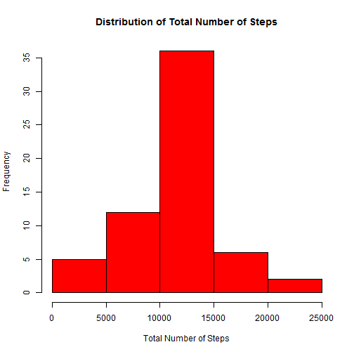

## Loading and preprocessing the data

First, read the data and take a look at it.

```r
# Read the data
activity<-read.csv("activity.csv")
# Look at the data
str(activity)
```

```
## 'data.frame':	17568 obs. of  3 variables:
##  $ steps   : int  NA NA NA NA NA NA NA NA NA NA ...
##  $ date    : Factor w/ 61 levels "2012-10-01","2012-10-02",..: 1 1 1 1 1 1 1 1 1 1 ...
##  $ interval: int  0 5 10 15 20 25 30 35 40 45 ...
```

The 'date' variable needs to be converted from Factor class to Date class to be able to properly analyze by date.


```r
activity$date<-as.Date(activity$date)
```

## What is mean total number of steps taken per day?

In order to find the average number of steps taken per day, we need to first calculate the total number of steps for each day.


```r
library(dplyr)
activityTotal<-summarize(group_by(activity,date),totalSteps=sum(steps))
# Create a histogram to look at how Total Number of Steps/Day are distributed
hist(activityTotal$totalSteps,xlab="Total Number of Steps", main="Distribution of Total Number of Steps",col="red")
```

 

Now, find the mean and median Total number of steps.


```r
meanTotalSteps<-mean(activityTotal$totalSteps,na.rm=TRUE)
medianTotalSteps<-median(activityTotal$totalSteps,na.rm=TRUE)
```

The mean total number of steps per day is 1.0766189 &times; 10<sup>4</sup> and the median total number of steps per day is 10765.

## What is the average daily activity pattern?


```r
library(dplyr)
activityAvg<-summarize(group_by(activity,interval),avgSteps=mean(steps,na.rm=T))
# Make a time-series plot

library(ggplot2)
```

```
## Warning: package 'ggplot2' was built under R version 3.1.2
```

```r
ggplot(activityAvg, aes(x=interval, y=avgSteps,  ymin = 0, ymax = avgSteps)) +     
  geom_line() +   
  labs(title="Average number of steps by interval for weekdays and weekends") +
  labs(x="Interval")+
  labs(y="Number of steps")+
  theme(legend.position="none") 
```

 

```r
maxInterval<-activityAvg[which.max(activityAvg$avgSteps),1]
```
The interval corresponding to maximum average number of steps for all days is 835.

## Imputing missing values

The number of missing values can be computed as below:


```r
nMissing<-nrow(activity[!complete.cases(activity),])
```

The number of rows with missing values is 2304. Since the presence of missing values can distort the results and findings, it is prudent to impute them. Let's replace the missing values with the mean for the corresponding 5-minute interval.


```r
activityMerge<-merge(activity,activityAvg,by="interval") # Merge the average dataset with the original
activityImputed<-activityMerge
i<-1
while(i<=nrow(activityImputed)){
    if(is.na(activityImputed[i,"steps"])==TRUE){
    activityImputed[i,"steps"]<-activityImputed[i,"avgSteps"]
    } 
  i<-i+1   # Loop through the rows and replace NAs with corresponding Average value
}
```

Now, create a histogram to see how the total number of steps for each day are distributed.


```r
library(dplyr)
activityImputedTotal<-summarize(group_by(activityImputed,date),totalSteps=sum(steps))
hist(activityImputedTotal$totalSteps,xlab="Total Number of Steps", main="Distribution of Total Number of Steps",col="red")
```

 

Now, find the mean and median Total number of steps.


```r
meanTotalStepsImputed<-mean(activityImputedTotal$totalSteps)
medianTotalStepsImputed<-median(activityImputedTotal$totalSteps)
```

The mean total number of steps per day is 1.0766 &times; 10<sup>4</sup> and the median total number of steps per day is 1.0766189 &times; 10<sup>4</sup>.
By comparing these results from the earlier values when missing values were not imputed, we can see that there has not been much difference.

## Are there differences in activity patterns between weekdays and weekends?

Create a factor variable to indicate weekday and weekend and attach it to the activity dataset.


```r
i<-1
weekday<-vector(mode="character",length=nrow(activityImputed))
while (i <= nrow(activityImputed)){
  if(weekdays(activityImputed[i,"date"])=="Sunday"||weekdays(activityImputed[i,"date"])=="Saturday"){
    weekday[i]<-"Weekend"
    } else{
      weekday[i]<-"Weekday"
      }  
  i<-i+1
}
  
activityWeek<-cbind(activityImputed,weekday)
activityWeek$weekday<-factor(activityWeek$weekday)
```

Now, create a time-series plot depicting the average number of steps for each interval for both weekdays and weekends


```r
activityWeekAvg<-summarize(group_by(activityWeek,interval,weekday),avgSteps=mean(steps,na.rm=T))
library(ggplot2)
ggplot(activityWeekAvg, aes(x=interval, y=avgSteps, group = weekday, colour = weekday,ymin = 0, ymax = avgSteps)) +     
  geom_line() + 
  facet_grid(weekday~.)+
  labs(title="Average number of steps by interval for weekdays and weekends") +
  labs(x="Interval")+
  labs(y="Number of steps")+
  theme(legend.position="none") 
```

 

The plot indicates that the weekends record slightly more number of steps compared to weekdays although the maximum number of steps is more for weekdays.
